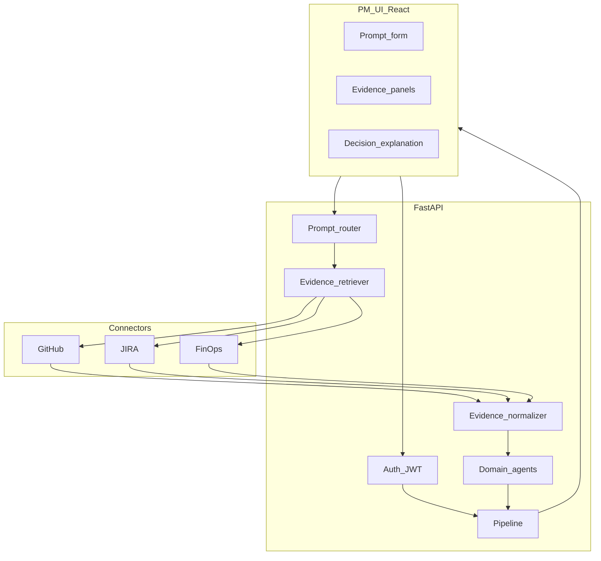

# AgileOps Agentic Framework (AAF)

Governance pipeline: **consensus**, **RAR**, **utility scoring**, and **explainability**, with GitHub / JIRA / FinOps connectors (simulation or live), a **FastAPI** backend, and a **React + Vite** PM UI.

## Architecture



## Design docs

- [Governance pipeline architecture](docs/design/governance-pipeline-architecture.md) — connectors → agents → orchestrator → brief, with guardrails and LLM cost controls
- [Phase 1 governance flow](docs/design/phase-1-governance-flow.md) — keyword classifier → static weighted agents → 1 LLM explanation (~4s)
- [Phase 3 governance flow](docs/design/phase-3-governance-flow.md) — LLM intent router → LLM tool-calling agents → unchanged orchestrator → richer brief (~12s, 7–9 LLM calls)

## Quick start (API + UI)

**1. Backend**

```bash
cd /path/to/AAF_AppTestify
python3 -m venv .venv && source .venv/bin/activate
pip install -r requirements.txt
export PYTHONPATH="$(pwd)"   # if not using editable install
cp .env.example .env         # edit JWT_SECRET, SUPERADMIN_*, ADMIN_* (distinct emails)
uvicorn app.main:app --reload --host 0.0.0.0 --port 8000
```

**2. Frontend** (separate terminal)

```bash
cd frontend
npm install
npm run dev
```

Open `http://localhost:5173`. The dev server proxies `/api` to `http://127.0.0.1:8000`.

Optional helper (starts API in background then Vite; Ctrl+C stops both):

```bash
chmod +x scripts/dev.sh
./scripts/dev.sh
```

**3. Sign in**

Use **tenant admin** credentials from `.env` (`ADMIN_EMAIL` / `ADMIN_PASSWORD`) for day-to-day PM runs, or **superadmin** (`SUPERADMIN_EMAIL` / `SUPERADMIN_PASSWORD`) to manage tenants and run batch. The browser UI authenticates via an **httpOnly `access_token` cookie** set on login (not returned in the JSON body).

## API (for scripts or other clients)

**Authentication:** `POST /api/v1/auth/login` sets an httpOnly `access_token` cookie. Protected routes read that cookie automatically — use `curl -c/-b cookie.jar` or `credentials: "include"` in fetch. The login response body contains user metadata only (no token field).

| Method | Path | Notes |
|--------|------|--------|
| GET | `/health` | Liveness |
| GET | `/metrics?window_seconds=300` | Prometheus text when `METRICS_PUBLIC_ENABLED=true` (404 otherwise; **disabled in production**) |
| POST | `/api/v1/auth/login` | JSON `{"email","password"}` → sets httpOnly cookie + user JSON (roles, tenant) |
| GET | `/api/v1/auth/me` | httpOnly cookie |
| GET | `/api/v1/auth/signup-status` | Public — whether tenant self-signup is enabled |
| POST | `/api/v1/auth/signup-tenant` | Public (when enabled) — create tenant + tenant admin account |
| GET | `/api/v1/prompts/library` | Public prompt library |
| GET | `/api/v1/admin/tenants` | **Superadmin** — list tenants + user counts |
| POST | `/api/v1/admin/tenants` | **Superadmin** — JSON `{"name","slug"}` create tenant |
| POST | `/api/v1/governance/run` | httpOnly cookie — full pipeline JSON |
| POST | `/api/v1/governance/batch` | **Tenant admin or superadmin** — runs prompt library |
| POST | `/api/v1/governance/runs` | httpOnly cookie — queue async governance run |
| GET | `/api/v1/governance/runs` | httpOnly cookie — list persisted governance runs |
| GET | `/api/v1/governance/runs/{id}` | httpOnly cookie — run status + result |
| POST | `/api/v1/governance/cases` | **Tenant admin/superadmin** — create governance case |
| GET | `/api/v1/governance/cases` | httpOnly cookie — list cases in tenant scope |
| PATCH | `/api/v1/governance/cases/{id}` | **Tenant admin/superadmin** — update case lifecycle |
| POST | `/api/v1/governance/cases/{id}/decisions` | **Tenant admin/superadmin** — create decision |
| POST | `/api/v1/governance/decisions/{id}/approve` | **Approver permission / admin fallback** |
| GET | `/api/v1/governance/audit-events` | **Tenant admin/superadmin** — governance audit feed |
| GET | `/api/v1/governance/policies` | httpOnly cookie — tenant policy thresholds |
| PUT | `/api/v1/governance/policies/{name}` | **settings.manage permission / admin fallback** |
| GET | `/api/v1/reports/runs/summary?format=json|csv` | httpOnly cookie — export run summaries |
| GET | `/api/v1/reports/audit-events?format=json|csv` | **cases.manage permission / admin fallback** — export audit feed |
| GET | `/api/v1/telemetry/summary` | httpOnly cookie — dashboard KPIs + integration telemetry summary |
| GET | `/api/v1/telemetry/observability/summary` | httpOnly cookie — rolling API/worker SLI snapshot (latency/error/throughput) |
| GET | `/api/v1/telemetry/observability/metrics` | httpOnly cookie — Prometheus text metrics export |
| GET | `/api/v1/rbac/me/permissions` | httpOnly cookie — resolved RBAC permissions |
| GET | `/api/v1/tenant/settings` | Authenticated tenant user/superadmin — tenant settings view |
| PATCH | `/api/v1/tenant/settings` | **Tenant admin or superadmin** — update tenant settings |
| GET | `/api/v1/tenant/connectors` | Authenticated tenant user/superadmin — connector settings |
| PUT | `/api/v1/tenant/connectors` | **Tenant admin or superadmin** — save connector settings |
| POST | `/api/v1/tenant/connectors/{name}/validate` | **Tenant admin or superadmin** — validate connector config |
| GET | `/api/v1/tenant/ai/providers` | Authenticated tenant user/superadmin — provider settings |
| PUT | `/api/v1/tenant/ai/providers` | **Tenant admin or superadmin** — save AI provider settings |
| POST | `/api/v1/tenant/ai/providers/{name}/validate` | **Tenant admin or superadmin** — validate provider config |

## Connectors: simulation vs live

Set in `.env`:

- `CONNECTOR_MODE=sim` (default) — reads JSON fixtures under `fixtures/github`, `fixtures/jira`, `fixtures/finops`.
- `CONNECTOR_MODE=live` — requires `GITHUB_TOKEN` + `GITHUB_REPO`, JIRA (`JIRA_URL`, `JIRA_EMAIL`, `JIRA_API_TOKEN`), and/or `FINOPS_COST_FILE` for file-based cost data.

See [.env.example](.env.example) for database, auth, and tenant bootstrap variables.

## OpenTelemetry and metrics scraping

- **OTLP export (traces + metrics):** set `OTEL_EXPORTER_OTLP_ENDPOINT` to your collector base URL (HTTP/protobuf), for example `https://otel.example.com:4318`. Optional `OTEL_EXPORTER_OTLP_HEADERS` (comma-separated `Key=Value`). Optional `OTEL_SERVICE_NAME` (defaults to `aaf-governance`). The app registers OTLP HTTP exporters for `/v1/traces` and `/v1/metrics` and instruments FastAPI when the endpoint is set.
- **Authenticated Prometheus:** `GET /api/v1/telemetry/observability/metrics` (httpOnly cookie) returns the same in-process gauges as `/metrics`.
- **Public scrape (dev only):** `METRICS_PUBLIC_ENABLED=true` exposes `GET /metrics` without auth. Startup rejects this when `APP_ENV=prod`.

## Multi-tenancy, superadmin, and database

On startup the app:

1. Creates SQLAlchemy tables (including **`tenants`** and **`users.tenant_id`**).
2. Ensures a **default tenant** exists (`DEFAULT_TENANT_SLUG`, default `default`).
3. Creates a **superadmin** user (`SUPERADMIN_EMAIL` / `SUPERADMIN_PASSWORD`) if missing — platform scope, `tenant_id` null, `is_superadmin=True`.
4. Creates a **tenant admin** on the default tenant (`ADMIN_EMAIL` / `ADMIN_PASSWORD`) if missing — `is_admin=True`, `tenant_id` set. This email must **not** match the superadmin email.
5. **Backfills** `tenant_id` on any legacy non-superadmin users that still have a null tenant.

Governance **run** accepts any authenticated user. **Batch**, tenant CRUD, and tenant config writes follow the rules in the API table above.

Tenant connector + AI provider settings are now available through `/api/v1/tenant/*` APIs. Runtime governance resolves tenant config first, then falls back to env defaults from `.env`.

Company settings now support:

- encrypted-at-rest LLM keys (`PATCH /api/v1/tenant/settings` with `llm_keys`)
- hybrid RAG configuration (`rag_config_json`, including optional inline document set)
- connector credentials in encrypted payloads (`credentials_json` on connector upsert)

Supported connectors for telemetry + evidence: `github`, `jira`, `azure`, `aws`, `finops`.
Supported AI providers: `openai`, `anthropic`, `azure_openai`, `aws_bedrock`.

Governance Copilot V1 adds:

- persisted async run lifecycle (`queued`, `running`, `succeeded`, `failed`)
- case + decision workflow APIs
- governance audit-event stream
- tenant policy thresholds
- RBAC permission lookup (`/rbac/me/permissions`) with backward-compatible admin fallback
- production safety checks (unsafe secrets/default admin passwords blocked when `APP_ENV=prod`)

## DB migrations (Alembic)

Alembic is configured under `alembic/` with baseline revision `0001_governance_v1`.

```bash
# from repo root
alembic upgrade head
```

Create a new migration after model edits:

```bash
alembic revision --autogenerate -m "describe change"
alembic upgrade head
```

For full migration notes, see `docs/migrations.md`.

## Tests

```bash
export PYTHONPATH="$(pwd)"
pytest
```

## Production build (static UI)

```bash
cd frontend && npm run build
```

Serve `frontend/dist` with any static host, or mount behind the same origin as the API and set `VITE_*` / reverse-proxy so `/api` reaches FastAPI.

### SPA fallback requirement

If users open deep links like `/app/home` directly and see `Not Found`, your server/reverse proxy is missing SPA fallback rewrite.

- Keep `/api/*`, `/health`, `/metrics` routed to FastAPI.
- Rewrite all other unknown paths to `frontend/dist/index.html`.

### Not Found troubleshooting

1. Verify backend is this repo's latest build:
   - `curl http://127.0.0.1:8000/openapi.json` should include `/api/v1/governance/runs`, `/api/v1/telemetry/summary`, `/api/v1/tenant/settings`.
2. Ensure only one backend on port 8000:
   - `lsof -nP -iTCP:8000 -sTCP:LISTEN`
3. Restart via `scripts/dev.sh` (now fails fast if port 8000 is occupied).

Python 3.11+ is recommended (per `pyproject.toml`). Python 3.9 may work with `pip install -r requirements.txt` and `PYTHONPATH` set as above.
