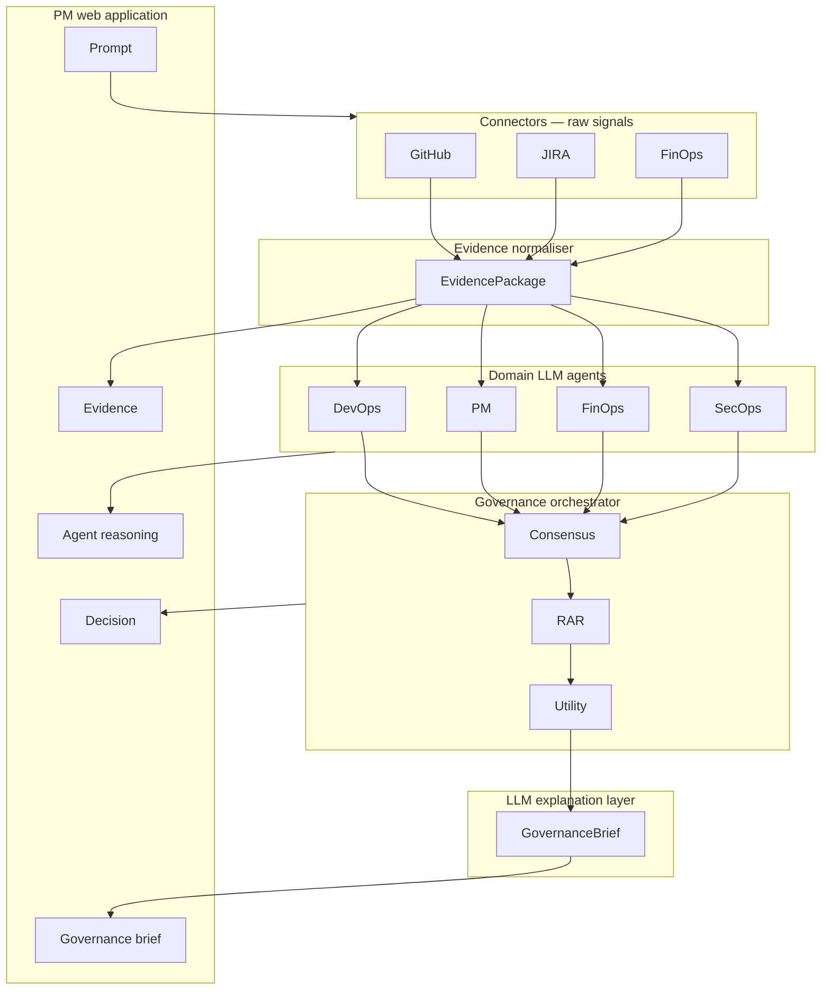
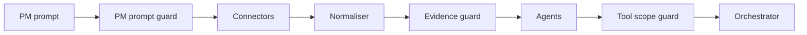

# Governance Pipeline Architecture

High-level design for the AI-driven governance stack: connectors through domain agents, orchestration, LLM explanation, and the PM web app — with input/output guardrails and LLM cost controls at each boundary.

Related flows:

- [Phase 1 governance flow](phase-1-governance-flow.md) — static agents, single LLM explanation
- [Phase 3 governance flow](phase-3-governance-flow.md) — LLM intent router and tool-calling agents

---

## Vertical stack

| Layer | Code path | Output type |
|-------|-----------|-------------|
| Connectors | `connectors/*_connector.py`, `governance_service._fetch_raw_evidence` | Raw JSON per source |
| Evidence normaliser | `connectors/evidence_normalizer.normalize_all` | `list[EvidenceRecord]` |
| Domain agents | `agents/devops.py`, `pm_agent.py`, `finops.py`, `devsecops.py` | `AgentOpinion` (alias **AgentOutput**) |
| Orchestrator | `orchestrator/consensus.py`, `rar.py`, `utility.py` | `ConsensusResult`, `RARResult`, `UtilityResult` |
| LLM explanation | `orchestrator/pipeline.run_pipeline` | Markdown explanation |
| PM app | `frontend/` workspace pages | **GovernanceBrief** + 5-screen UX |

---

## Input guardrails (salmon)

Applied before data reaches agents or external tools.

| Guard | Position | Checks | Module |
|-------|----------|--------|--------|
| **PM prompt guard** | Pipeline entry | Injection, PII, max length | `guardrails/pm_prompt_guard.py` |
| **Evidence guard** | After normaliser | PII in summaries, size cap, stale ratio | `guardrails/evidence_guard.py` |
| **Prompt injection guard** | During agent tool loops | Tool misuse, scope, call budget | `guardrails/tool_scope_guard.py` |

---

## Output guardrails (salmon)

Applied on structured outputs before the PM sees results.

| Guard | Position | Checks | Module |
|-------|----------|--------|--------|
| **Agent output guard** | After each agent | JSON schema, confidence ∈ [0,1] | `guardrails/agent_output_guard.py` |
| **Brief output guard** | After LLM explanation | Hallucination vs decision, action lock | `guardrails/brief_output_guard.py` |

**Action lock:** the LLM explanation layer cannot override `UtilityResult.recommended_action`; orchestrator decision is authoritative.

---

## FinOps controls (green)

| Component | Metrics | Module |
|-----------|---------|--------|
| **LLM cost tracker** | Tokens in/out, cost per agent call, per run, monthly workspace total | `guardrails/llm_cost_tracker.py` |
| **Budget cap + alert** | 80% warning, 100% hard block | `guardrails/budget_cap.py` |

Cost tracker hooks intercept LLM calls from agents and the explanation layer. Budget cap runs before a governance run starts.

---

## Integration points

| Entry | Guardrail wiring |
|-------|------------------|
| `POST /governance/run` | PM prompt guard → 422 on block |
| `POST /api/v1/governance/runs` | PM prompt guard before queue |
| `run_jobs.process_run_sync` | PM prompt guard before `run_governance` |
| `run_governance` | Central guard + sanitized prompt for downstream |
| `run_pipeline` | Evidence, agent output, brief guards (T-106) |

Feature flag: `Settings.guardrails_enabled` (default `true`).

---

## Jira backlog

Epic **[CAS-116](https://apptestify.atlassian.net/browse/CAS-116)** — Architecture guardrails & cost controls

| Ticket | Summary |
|--------|---------|
| [CAS-117](https://apptestify.atlassian.net/browse/CAS-117) | T-098 Architecture documentation |
| [CAS-118](https://apptestify.atlassian.net/browse/CAS-118) | T-099 PM prompt guard |
| [CAS-119](https://apptestify.atlassian.net/browse/CAS-119) | T-100 Evidence guard |
| [CAS-120](https://apptestify.atlassian.net/browse/CAS-120) | T-101 Tool scope guard |
| [CAS-121](https://apptestify.atlassian.net/browse/CAS-121) | T-102 Agent output guard |
| [CAS-122](https://apptestify.atlassian.net/browse/CAS-122) | T-103 Brief output guard |
| [CAS-123](https://apptestify.atlassian.net/browse/CAS-123) | T-104 LLM cost tracker |
| [CAS-124](https://apptestify.atlassian.net/browse/CAS-124) | T-105 Budget cap + alert |
| [CAS-125](https://apptestify.atlassian.net/browse/CAS-125) | T-106 Wire all guardrails |
| [CAS-126](https://apptestify.atlassian.net/browse/CAS-126) | T-107 Schema alignment |
| [CAS-127](https://apptestify.atlassian.net/browse/CAS-127) | T-108 PM 5-screen UX audit |
| [CAS-128](https://apptestify.atlassian.net/browse/CAS-128) | T-109 SecOps agent layer |

---

## Current implementation status

| Component | Status |
|-----------|--------|
| Connectors + normaliser | Shipped |
| Four domain agents | Shipped (`devsecops` → SecOps in T-109) |
| Orchestrator (consensus, RAR, utility) | Shipped |
| LLM explanation | Partial (`run_with_llm`) |
| PM prompt guard | Shipped (CAS-118) |
| Evidence guard | Shipped (CAS-119) |
| Agent output guard | Shipped (CAS-121) |
| Brief output guard | Shipped (CAS-122) |
| LLM cost tracker | Shipped (CAS-123) |
| Budget cap + alert | Shipped (CAS-124) |
| Tool scope guard + LLM tool loop | Shipped (CAS-120) |
| Full pipeline wiring | Shipped (CAS-125) |
| Schema/API parity (`GovernanceBrief`, `agent_outputs`) | Shipped (CAS-126) |
| 5-screen PM UX (stepper, Brief, guardrail panel) | Shipped (CAS-127) |
| SecOps intent routing + selective agents | Shipped (CAS-128) |
| LLM cost tracker + budget UI | Shipped |
