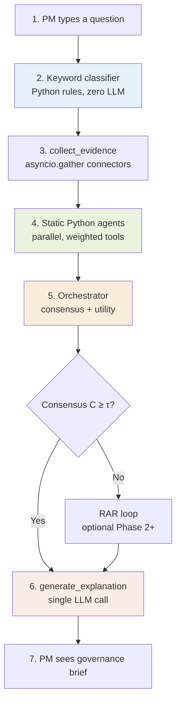

# Phase 1 — Static Python Agent Governance Flow

**Phase 1 constraints:** Static Python agents · No LLM inside agents · One LLM call total (explanation only)

This document describes how a PM prompt is translated into a governance brief: keyword classification → parallel evidence collection → weighted static agents → deterministic orchestration → single LLM explanation.

---

## End-to-end flow



| Step | Component | LLM? | Typical latency |
|------|-----------|------|-----------------|
| 1 | PM prompt | — | — |
| 2 | Keyword classifier | No | &lt;1 ms |
| 3 | Evidence collection | No | ~2–3 s |
| 4 | Static agents (×3–4) | No | ~100–300 ms |
| 5 | Orchestrator | No | &lt;1 ms |
| 6 | `generate_explanation()` | **Yes (1 call)** | ~1–2 s |
| 7 | Governance brief | — | — |

**Phase 1 targets:** ~4 s total latency · ~$0.001 per run · 100% reproducible (steps 2–5)

---

## 1. PM types a question

**Example prompt:**

> Should we release the payments service today?

The prompt is stored on the governance run and passed unchanged through classification, orchestration context, and the final explanation.

---

## 2. Keyword classifier — Python rules, zero LLM

Simple Python rules match intent from the prompt text. No embedding model, no LLM.

```python
keywords = ["release", "deploy", "ship", "ready", "go", "today", "monday"]
if any(k in prompt.lower() for k in keywords):
    intent = IntentCategory.RELEASE_READINESS
    agents = [DevOpsAgent, PMAgent, FinOpsAgent]
```

| Intent | Trigger keywords (examples) | Agents activated | Connectors |
|--------|---------------------------|------------------|------------|
| `RELEASE_READINESS` | release, deploy, ship, today, monday | DevOps, PM, FinOps | GitHub, Jira, FinOps |
| `DELIVERY_HEALTH` | sprint, blocked, behind, velocity | PM | Jira |
| `COST_ANOMALY` | spend, budget, bill, scaling | FinOps | AWS Cost Explorer |
| `SECURITY_GATE` | cve, secret, vulnerability, policy | DevSecOps | GitHub Security |

Takes **&lt;1 ms**. Connector routing uses the same keyword family (see `pm_interface/router.py`).

---

## 3. Evidence collection — connectors in parallel

`collect_evidence()` fires GitHub, Jira, and AWS Cost Explorer **simultaneously** via `asyncio.gather()`.

```python
package = await asyncio.gather(
    github_connector.fetch(window="24h"),   # CI, deployments, PRs
    jira_connector.fetch(window="sprint"), # stories, blockers, bugs
    finops_connector.fetch(window="7d"),   # spend, budget, scaling
)
→ EvidencePackage(signals=45, run_id="abc123")
```

**EvidencePackage properties:**

- ~45 normalized signals from all sources
- Timestamps aligned to UTC
- Deduplicated by `(source, kind, external_id)`
- Staleness-tagged (`fresh` / `stale` / `expired`)

Takes **~2–3 seconds** (network-bound).

---

## 4. Static Python agents — parallel, weighted tools

Each activated agent receives the **same** `EvidencePackage`. Each agent:

1. Calls its 4–7 Python tools (filter relevant signals)
2. Each tool returns a score **0–1**
3. Agent confidence = Σ (tool_score × tool_weight)
4. Agent emits a **claim** string from deterministic rules

**No LLM inside agents.**

### Example: release readiness run

**DevOps agent**

| Tool | Score | Weight | Contribution |
|------|-------|--------|--------------|
| `get_ci_status()` | 0.40 | 0.35 | 0.14 |
| `get_deploy_history()` | 0.60 | 0.25 | 0.15 |
| `detect_rollbacks()` | 0.80 | 0.25 | 0.20 |
| `check_branch_protection()` | 0.00 | 0.15 | 0.00 |

**Confidence: 0.54**  
**Claim:** "Deployment instability detected — CI failing and recent rollbacks"

**PM agent**

| Tool | Score | Weight |
|------|-------|--------|
| `get_sprint_status()` | 0.78 × 0.10 |
| `count_blockers()` | 0.60 × 0.40 |
| `get_open_defects()` | 0.40 × 0.30 |
| `calc_velocity_risk()` | 0.30 × 0.20 |

**Confidence: 0.50**  
**Claim:** "Delivery risk detected — 3 blockers and 1 critical bug open"

**FinOps agent**

| Tool | Score | Weight |
|------|-------|--------|
| `get_spend_trend()` | 0.70 × 0.30 |
| `check_budget_pace()` | 0.20 × 0.25 |
| `detect_scaling_anomaly()` | 0.80 × 0.25 |
| `calc_unit_cost()` | 0.30 × 0.20 |

**Confidence: 0.52**  
**Claim:** "Cloud cost anomaly — auto-scaling spike without traffic increase"

Implementation: `agents/*` via `BaseAgent.run_tools()` → `tools/scoring.py`.

---

## 5. Orchestrator — consensus, utility, action selection

All deterministic Python. No LLM.

### Consensus

```
C = 0.5 × mean([agent.confidence]) + 0.5 × domain_agreement
C = 0.5 × 0.52 + 0.5 × 0.84 = 0.68  ✓ (above τ = 0.65)
```

When **C ≥ τ**, the RAR loop is skipped (Phase 1 default).

### Utility scoring

Each candidate action receives a utility score **U**:

```
U(MITIGATE) = 0.4×0.55 + 0.3×0.70 + 0.3×0.65 = 0.635  ← highest
U(HOLD)     = 0.4×0.30 + 0.3×0.60 + 0.3×0.80 = 0.540
```

**Selected action:** `MITIGATE_AND_MONITOR`

Implementation: `orchestrator/consensus.py`, `orchestrator/utility.py`.

---

## 6. `generate_explanation()` — the only LLM call

The LLM receives the structured **`GovernanceDecision`** only — not raw signals, not agent code.

**Input JSON (abbreviated):**

```json
{
  "prompt": "Should we release the payments service today?",
  "consensus_score": 0.68,
  "recommended_action": "MITIGATE_AND_MONITOR",
  "agent_claims": [
    {"agent": "devops", "confidence": 0.54, "claim": "..."},
    {"agent": "pm", "confidence": 0.50, "claim": "..."},
    {"agent": "finops", "confidence": 0.52, "claim": "..."}
  ]
}
```

**Model:** claude-haiku-4-5 or gpt-4o-mini · **~500 tokens** · **~$0.001/run**

Implementation: `orchestrator/pipeline.py` (LLM branch) with deterministic fallback in `llm/deterministic_explainer.py`.

---

## 7. PM sees the governance brief

**Governance brief — MITIGATE AND MONITOR**

> Releasing the payments service today carries moderate risk across three domains. The CI pipeline has a 40% pass rate with 3 of 5 recent runs failing at the test step, and 2 rollbacks were detected in the last 24 hours. Three stories remain blocked in the current sprint, including one critical bug open for 3 days. An auto-scaling anomaly has increased cloud spend by 44% without a corresponding traffic increase. Recommend investigating the rollback cause and resolving the critical bug before releasing. Monitor the scaling configuration in parallel.

---

## Code map (current implementation)

| Step | Spec | Code today | Gap |
|------|------|------------|-----|
| 2 Intent classifier | `IntentCategory` + agent list | Connector keyword/semantic routing only | Agent activation by intent |
| 3 Parallel evidence | `asyncio.gather` all connectors | Sequential `_fetch_raw_evidence` | Parallelize fetches |
| 4 Static agents | No LLM in agents | `BaseAgent` + optional `run_with_llm` | Phase 1 flag to disable agent LLM |
| 5 Consensus formula | 0.5×mean + 0.5×agreement | Theme-weighted dominant share | Align formula to spec |
| 6 Single LLM | GovernanceDecision only | Pipeline passes opinions JSON | Tighten prompt schema |
| 7 UI flow | 7-step decision flow | `deriveDecisionFlow()` (6 steps) | Add classifier + explanation steps |

---

## Related docs

- [Tool registry (28 tools)](../../scripts/jira_create_tool_registry.py) — agent tool contracts
- [Gap analysis](../gap-analysis-competitor-research.md) — Phase 2+ LLM-per-agent roadmap
