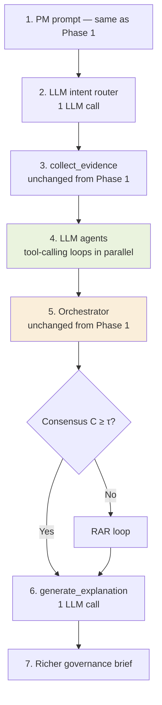

# Phase 3 — LLM-Powered Agentic Governance Flow

**Phase 3 constraints:** Each agent is an LLM that calls tools in a reasoning loop · 7–9 LLM calls total · Orchestrator unchanged from Phase 1

This document describes how the same PM prompt produces a richer, more decisive governance brief when agents reason with selective tool-calling instead of static weighted formulas.

**Compare:** [Phase 1 flow](phase-1-governance-flow.md) (static Python agents, 1 LLM call)

---

## End-to-end flow



| Step | Component | LLM calls | Typical latency |
|------|-----------|-----------|-----------------|
| 1 | PM prompt | — | — |
| 2 | LLM intent router | 1 | ~1 s |
| 3 | Evidence collection | 0 | ~2–3 s |
| 4 | LLM agents (×3) | 4–6 (1–2 per agent) | ~6–8 s |
| 5 | Orchestrator | 0 | &lt;1 ms |
| 6 | `generate_explanation()` | 1 | ~1–2 s |
| 7 | Governance brief | — | — |

**Phase 3 targets:** ~12 s total · ~$0.008/run · 6 of 21 tools actually invoked (selective)

---

## 1. PM types the same question

**Example prompt (identical to Phase 1):**

> Should we release the payments service today?

---

## 2. LLM intent router — 1 LLM call

Unlike Phase 1 keyword rules, the LLM router understands nuance:

- "Are we good for Monday?" → `release_readiness`
- "Can we go?" → `release_readiness`
- "Is it safe?" → `release_readiness`

**System prompt:**

```
Classify this PM governance question into one of:
release_readiness | reliability | cost | security | cross_domain
Return JSON: { intent, agents_needed[], reasoning }
```

**LLM response:**

```json
{
  "intent": "release_readiness",
  "agents_needed": ["devops", "pm", "finops"],
  "reasoning": "Release decision query — need pipeline, delivery, and cost signals"
}
```

Routes to **DevOps + PM + FinOps** (same agents as Phase 1 for this prompt, but discovered via semantics not keywords).

---

## 3. Evidence collection — identical to Phase 1

`collect_evidence()` is **completely unchanged** between phases:

- Same connectors (GitHub, Jira, FinOps)
- Same `EvidencePackage` (~45 signals)
- Pre-fetched so agent tools return **instantly from the package**, not live APIs

The LLM agents decide *which* signals to inspect via tool calls — evidence is already in memory.

---

## 4. LLM agents — selective tool-calling loops

Each agent receives:

- System prompt (domain role)
- Tool definitions (7 per agent from [tool registry](../design/phase-1-governance-flow.md))
- Evidence summary

The LLM **decides which tools to call**, reads results, reasons, and **stops when it has enough evidence**. It does not call tools it does not need.

### DevOps LLM agent

| Step | Action |
|------|--------|
| Tool 1 | `get_ci_status()` → pass_rate 0.40, failing step: test |
| Think | "40% pass rate is very low. Check rollbacks too." |
| Tool 2 | `detect_rollbacks()` → 2 rollbacks in 24h, payments-service |
| Think | "CI failing + 2 rollbacks = high risk. Stop." |

**Confidence: 0.87** · **2 of 7 tools called**  
Skipped: `check_branch_protection`, `get_pr_status`, `get_commit_activity`, `get_deploy_history`, `check_pipeline_config`

### PM LLM agent

| Step | Action |
|------|--------|
| Tool 1 | `count_blockers()` → 3 blocked, 1 on platform dependency 5 days |
| Think | "Significant blockers. Check critical bugs." |
| Tool 2 | `get_open_defects()` → 1 critical bug in payments, customer-reported |
| Think | "Blockers + critical customer bug = clear delivery risk. Done." |

**Confidence: 0.82** · **2 of 7 tools called**

### FinOps LLM agent

| Step | Action |
|------|--------|
| Tool 1 | `get_spend_trend()` → +44% WoW, EC2 search-service top driver |
| Think | "44% spike — traffic-driven or misconfiguration?" |
| Tool 2 | `detect_scaling_anomaly()` → orphan_scale=true, 47 instances, no traffic |
| Think | "Confirmed misconfig. Root cause found. Stop." |

**Confidence: 0.79** · **2 of 7 tools called**

**Total tools invoked:** 6 of 21 across three agents.

---

## 5. Orchestrator — unchanged from Phase 1

The orchestrator receives `AgentOpinion` objects with the **same schema** as Phase 1. It does not know agents are LLMs.

`compute_consensus()`, `run_rar_loop()`, `score_actions()` run identically.

Higher LLM-derived confidences push consensus above τ more easily:

```
C = 0.5 × mean([0.87, 0.82, 0.79]) + 0.5 × domain_agreement
C = 0.5 × 0.826 + 0.5 × 0.91 = 0.87  ✓ (well above τ=0.65, no RAR)
```

**Utility (Phase 3 — stronger hold signal):**

```
U(HOLD_RELEASE) = 0.4×0.30 + 0.3×0.55 + 0.3×0.90 = 0.555  ← highest
U(MITIGATE)     = 0.4×0.55 + 0.3×0.65 + 0.3×0.70 = 0.625
→ selected_action: HOLD_RELEASE
```

Phase 1 produced `MITIGATE_AND_MONITOR` at C=0.68; Phase 3 reaches a **stronger, more specific** conclusion.

---

## 6. `generate_explanation()` — one more LLM call

Identical constraint to Phase 1: LLM receives structured `GovernanceDecision` only — cannot change action or add new evidence.

Difference: evidence strings are **richer and context-aware** because LLM agents produced specific, service-named claims.

---

## 7. PM sees a richer governance brief

**Governance brief — HOLD RELEASE**

> Hold release of the payments service. Three governance signals are aligned against release today. The CI pipeline is at 40% pass rate with the test suite failing, and two rollbacks of the payments service occurred in the last 24 hours — the same service being released. One critical customer-reported bug in the payments component has been open for 3 days with no resolution. A misconfigured auto-scaling policy has caused 47 instances to spin up without any traffic increase, adding unexpected cost exposure. All three signals point to the payments service specifically. Recommend: resolve the test failures and critical bug before rescheduling release; investigate the scaling policy configuration today.

---

## Phase 1 vs Phase 3 comparison

| Dimension | Phase 1 | Phase 3 |
|-----------|---------|---------|
| Intent routing | Keyword rules (&lt;1 ms) | LLM router (1 call) |
| Agents | Static weighted formula | LLM tool-calling loops |
| Tools per run | All tools per agent | Selective (6/21 in example) |
| Action | MITIGATE_AND_MONITOR | HOLD_RELEASE |
| Consensus C | 0.68 | 0.87 |
| Evidence | Formulaic scores | Context-aware, service-specific |
| LLM calls | 1 | 7–9 |
| Cost | ~$0.001 | ~$0.008 |
| Latency | ~4 s | ~12 s |

---

## Code map (implementation gaps)

| Step | Spec | Code today | Gap |
|------|------|------------|-----|
| 2 LLM intent router | JSON intent + agents_needed | Keyword/semantic connector routing only | New `llm/intent_router.py` |
| 3 Evidence package | Tools read from package | Tools may hit live APIs/sim fixtures | Package-backed tool execution |
| 4 Tool-calling loop | LLM picks tools iteratively | `run_with_llm` runs all tools then synthesizes | ReAct / tool-calling loop per agent |
| 5 Orchestrator | Unchanged | Same pipeline | Verify AgentOpinion schema stable |
| 5 HOLD_RELEASE | New action for strong hold | `PATCH_BLOCK_RELEASE` closest | Add `HOLD_RELEASE` to `GovernanceAction` |
| 6 Explanation | Same as P1 | Same pipeline | Pass richer `evidence` lines from agents |
| Metrics | 7–9 LLM call budget | Partial observability | Per-run LLM call counter + cost estimate |

---

## Related

- [Phase 1 governance flow](phase-1-governance-flow.md)
- [CAS-71 epic](https://apptestify.atlassian.net/browse/CAS-71) — tool registry (**shipped**: `data/tool_registry.json`, API, `/app/tool-registry`, `/capabilities`; see [agileops-tool-registry.md](agileops-tool-registry.md))
- [CAS-91 epic](https://apptestify.atlassian.net/browse/CAS-91) — Phase 1 flow implementation
